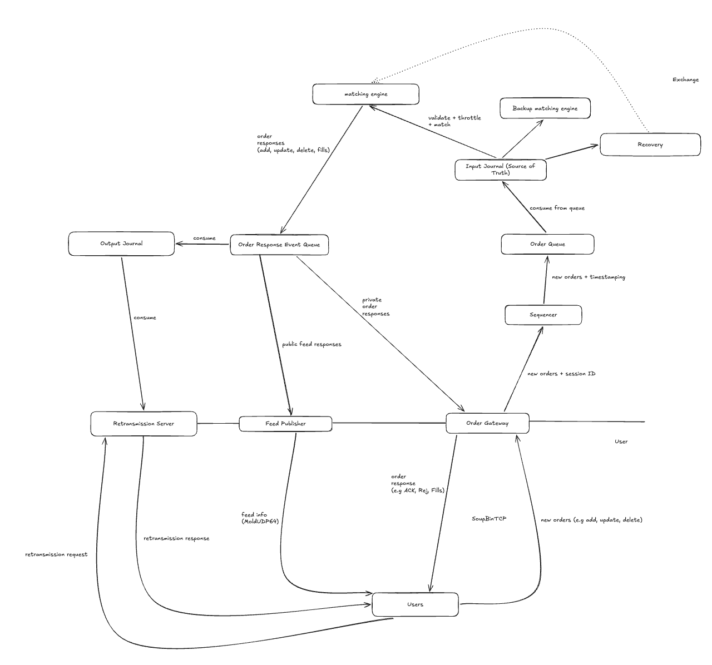

# Exchange Simulator

Exchange simulator written in C++23.

## Architecture


## Building

See [docs/build.md](docs/build.md).

Pick a preset: `debug`, `asan`, `tsan` or `release`. Each one builds into `build/<preset>/`.

```sh
cmake --preset debug          # configure (first time, or after editing CMakeLists.txt)
cmake --build --preset debug  # build
ctest --preset debug          # run all tests
./build/debug/exchange        # run the exchange
```

Useful variations:

```sh
ctest --preset debug -R Version                    # only tests whose name matches "Version"
./build/debug/tests/exsim_core_tests --gtest_filter='Version.*'  # run one test binary directly
cmake --preset debug -DEXSIM_WARNINGS_AS_ERRORS=ON  # build like CI does
```
## Development

### Adding a component
Example: adding a `book` component.

1. Put the headers and sources side by side in `src/exsim/book/`. Include them as `#include "exsim/book/order_book.hpp"` (the include root is `src/`).

2. Define the library in the root `CMakeLists.txt`. List every source file (no `file(GLOB)`) and link only the components it's allowed to depend on:

   ```cmake
   add_library(exsim_book
       src/exsim/book/order_book.cpp)
   add_library(exsim::book ALIAS exsim_book)
   target_include_directories(exsim_book PUBLIC src)
   target_compile_features(exsim_book PUBLIC cxx_std_23)
   target_link_libraries(exsim_book
       PUBLIC exsim::core
       PRIVATE exsim::options)
   ```

3. Put the tests in `tests/book/` and register them in `tests/CMakeLists.txt`:

   ```cmake
   add_executable(exsim_book_tests
       book/order_book_test.cpp)
   target_link_libraries(exsim_book_tests PRIVATE exsim::book exsim::options GTest::gtest_main)
   gtest_discover_tests(exsim_book_tests DISCOVERY_MODE PRE_TEST)
   ```